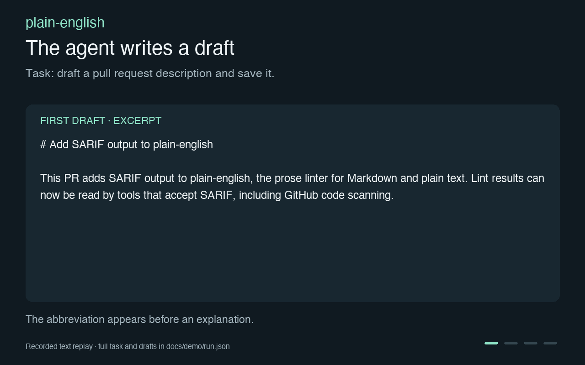

# plain-english

[](https://www.npmjs.com/package/plain-english)
[](https://github.com/nordscope-fi/plain-english/actions/workflows/ci.yml)
[](LICENSE)

Catch filler and unexplained jargon in your coding agent's writing.

`plain-english` checks a draft and gives the agent the passage, the rule, and a rewrite
hint. It can check documents, commit and pull request text, issues, and completed chat
replies. You control the rules and whether findings block a write.



## Install in Claude Code

In a Claude Code session, version 2.1.293 or newer:

```text
/plugin install plain-english --marketplace nordscope-fi/plain-english
```

The plugin runs checks automatically. With no project config, findings are advisory.
See [the plugin guide](integrations/claude-code-plugin/README.md) for configuration and
supported checks. For another agent, see [the setup below](#add-it-to-a-coding-agent).

## A real draft, checked before it was saved

Claude Code drafted a pull request description. The plugin caught an abbreviation used
without an explanation and refused the save. Claude revised it without another user
prompt, and the next save succeeded.

**First draft, excerpt:**

> # Add SARIF output to plain-english
>
> This PR adds SARIF output to plain-english, the prose linter for Markdown and plain text. Lint results can now be read by tools that accept SARIF, including GitHub code scanning.

**The finding returned to Claude:**

```text
line 1: "SARIF" (unglossed-term) "SARIF" is not explained. Say what it does, then name it.
```

**The agent's next draft, excerpt:**

> # Add Static Analysis Results Interchange Format (SARIF) output to plain-english
>
> This PR lets plain-english, the prose linter for Markdown and plain text, write its results in SARIF. SARIF is a standard format for reporting results from code analysis tools. With this change, tools that read SARIF, such as GitHub code scanning, can use plain-english results.

The animation replays text captured from a live run. Warning-level blocking was enabled
for this example. The [recording notes](docs/demo/README.md) include the full prompt,
drafts, configuration, and an earlier task that passed without a rewrite.

## Check files yourself

The command-line tool checks Markdown and plain text and reports exact passages and
rewrite hints:

```bash
npm install -D plain-english
npx plain-english lint .
```

Node 20 or newer is required. The first run needs no config. Blocking is opt-in. You can
tune the rules before they stop a build.

To make blocking findings return a failing exit code, add `.plain-english.yml`:

```yaml
version: 1
extends: default
failOn: error
```

Use `failOn: warn` to fail on warnings too. Use `failOn: never` to keep every run
advisory.

## What it checks

The built-in rules cover:

- stock transitions and filler, such as an opener that announces the conclusion;
- corporate verbs and vague claims that should name a concrete result;
- punctuation patterns strongly associated with generated prose;
- acronyms and product names used before they are explained;
- sentences that are long or show little variation across a document;
- suppressions that give no reason.
- internal citation markers and unfinished template fields;
- clusters of related findings that form one repeated pattern.

`plain-english explain` lists every rule. Pass a rule name to see its match, exceptions,
severity, and rewrite hint:

```bash
npx plain-english explain
npx plain-english explain unglossed-term
```

The explanation also shows whether a check is a writing-quality rule, a known
machine marker, or both. It includes the review date and supporting source.

The normal scan is deterministic. An optional model-backed check covers sentence shapes
that regular expressions cannot judge, such as vague attribution and canned contrasts.
Set `modelChecks: false` in the project config to keep extra checks local to pattern matching.
Extra model checks send eligible proposed document text or publishing text, and sometimes the last chat question, through the agent's configured provider and account.
Document context can include code examples and quoted material.
They use your plan or API usage. Claude calls disable local session persistence; provider retention still follows account settings.
Set `modelChecks: true` to enable the extra checks on other supported agents.
The native Claude plugin also adds declared project vocabulary and loaded writing-profile guidance at conversation start.
Agent support for that check varies. [The agent guide](docs/agents.md) records what each
integration can run.

## What it ignores

The scanner removes code, frontmatter, blockquotes, link targets, and tables before it
checks prose. A code sample that contains a banned word will not produce a finding.

Rules also include exceptions for valid technical uses. For example, a financial term
can pass while the same word used as a vague business verb can fail.

[The generated rule guide](docs/writing-style.md) lists the full ruleset, its exceptions,
and everything excluded from scanning.

## Add it to a coding agent

`init` adds the selected agent's hooks, a local launcher, project instructions, and a
starter config. It merges with files that already exist.

```bash
npx plain-english init --agent codex --dry-run
npx plain-english init --agent codex
```

The dry run shows the diff first.

Supported names are `claude-code`, `copilot`, `codex`, `cursor`, `vibe`, `gemini`,
`antigravity`, and `qwen`. Use `--agent all` to install every profile.

The hooks can check file edits, commit and pull request text, issue text, and completed
chat replies. Each agent exposes different hook events and trust controls. Read
[the agent guide](docs/agents.md) before relying on a hook as a gate.

For agents without a profile, run the linter after each edit. The
[post-edit guide](docs/post-edit-lint.md) gives a portable setup.

The [Claude Code plugin](#install-in-claude-code) provides automatic checks without
writing settings or launchers into the project.

## Add it to a build

For copy stored in JavaScript or TypeScript, use `lint src --source-prose`.
The [source guide](docs/source-prose.md) covers React text, escapes and source positions.

### GitHub Actions

```yaml
- uses: nordscope-fi/plain-english/integrations/github-action@v1.12.1
  with:
    paths: docs README.md
    fail-on: error
    check-pr-body: "true"
```

The action fails on blocking findings by default. It can also emit a findings file for
GitHub code scanning. [The adoption guide](docs/adopting.md) covers a staged rollout.

### pre-commit

If the repository already uses [pre-commit](https://pre-commit.com), add:

```yaml
repos:
  - repo: https://github.com/nordscope-fi/plain-english
    rev: v1.12.1
    hooks:
      - id: plain-english
      - id: plain-english-commit-msg
```

## Configure project vocabulary

Keep the built-in rules with `extends: default`, then add only the project-specific
differences:

```yaml
version: 1
extends: default
failOn: error

exclude:
  - "docs/reference/**"
  - "CHANGELOG.md"

rules:
  - id: showcase
    severity: warn
  - id: load-bearing
    severity: off
    reason: structural engineering term in this repository

readability:
  - id: unglossed-term
    known:
      - RevOps
      - ARR
```

Use a narrow allowance when one rule should ignore a project term:

```yaml
allow:
  - pattern: "\\bMRR\\b"
    rules: [unglossed-term]
    semantic: true
```

A bare pattern suppresses every rule on a matching line. Naming the affected rules avoids
hiding unrelated findings. Check the cost of each allowance with:

```bash
npx plain-english lint --show-suppressed
```

A complete example lives in [`examples/revops.yml`](examples/revops.yml).

## Learn this repository's existing style

A committed profile can give agents stable project preferences without changing lint
results. Choose the source files in `.plain-english.yml`:

```yaml
profile:
  file: .plain-english-profile.yml
  samples:
    technical-doc: ["docs/**/*.md"]
    repository: ["README.md", "CONTRIBUTING.md"]
```

Build it, check it in, then rerun `init` so agent guidance includes the stable results:

```bash
npx plain-english profile
npx plain-english profile --check
npx plain-english init --agent all
```

The profile stores paths, hashes, counts, summaries, common sentence connectors, and
recurring terms. It stores no excerpts. Small or inconsistent samples stay marked as
insufficient or mixed and do not reach agent guidance. Connectors and recurring terms
also wait for explicit approval:

```bash
npx plain-english profile --approve technical-doc:connectives,technical-doc:domainTerms
```

Approvals and the `preferences` mapping survive regeneration. Use `preferences` for
deliberate project choices that the source files cannot establish.

## Suppress one passage

Every suppression needs a reason after the colon.

```markdown
<!-- plain-english-disable-next-line leverage: finance term -->
<!-- plain-english-disable leverage: quoted customer wording -->
Text in the disabled range.
<!-- plain-english-enable -->
<!-- plain-english-disable-file: generated reference -->
```

Use project config for a repeated exception. Use a comment for a passage that should stay
unusual and visible to the next reader.

## Other commands

| Command | Purpose |
|---|---|
| `plain-english lint --chat --summary` | Check local agent transcripts and separate main replies from subagent replies. |
| `plain-english policy` | Write a policy page from the active config and installed hooks. |
| `plain-english policy --check` | Fail when that generated policy no longer matches the repo. |
| `plain-english profile` | Measure stable style preferences from configured project files. |
| `plain-english profile --check` | Fail when the committed profile is missing or stale. |
| `plain-english profile --approve GENRE:FIELD` | Approve measured connectors or recurring terms for agent guidance. |
| `plain-english doctor` | Print the environment details needed for a hook bug report. |
| `plain-english render --check` | Check that generated rules and agent instructions are current. |
| `plain-english --help` | Show all commands, formats, and exit behaviour. |

Chat transcripts can contain file contents, command output, and pasted text. Keep
`lint --chat` on the local machine. Do not run it in a build.

## Limits

This is a style checker. It finds configured patterns no matter who wrote them.

The rules are opinionated and English-only. False positives are expected. Some words in
the list are normal in a dialect, profession, or second-language writing style. The tool
cannot prove that text came from a model.

Read [the limitations](docs/limitations.md) before turning on blocking for a team. That
page also states which parts of chat each agent integration cannot reach.

## Contributing

```bash
npm ci
npm run build
npm test
npm run render && git diff --exit-code
npm run lint:self
```

Rules live in `rules/default.yml`. Generated guides and agent files should not be edited
by hand. A rule change needs corpus cases for the finding and its valid exceptions.

See [the documentation index](docs/README.md) for agent verification, design decisions,
editor output, and release notes.

## Licence

MIT.
